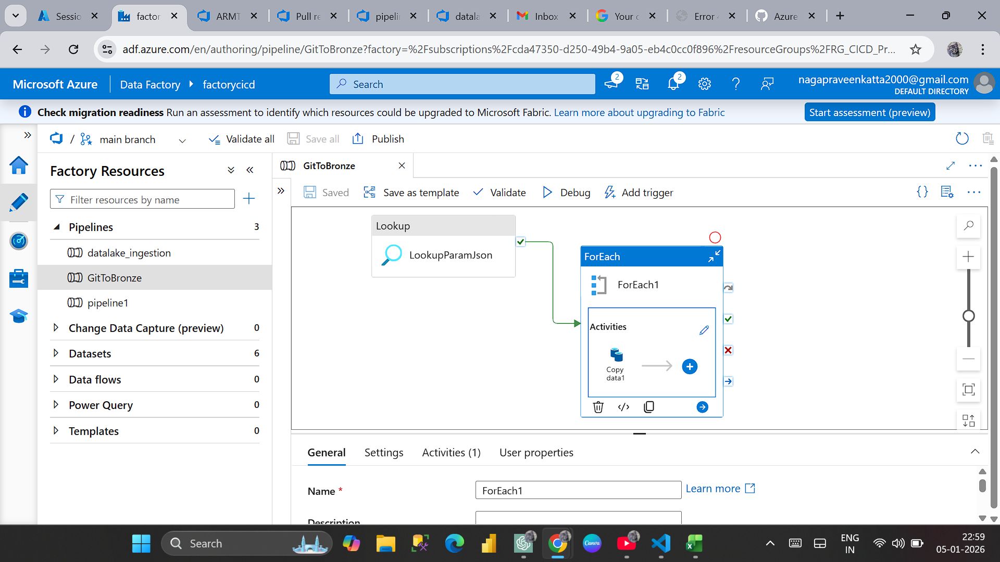
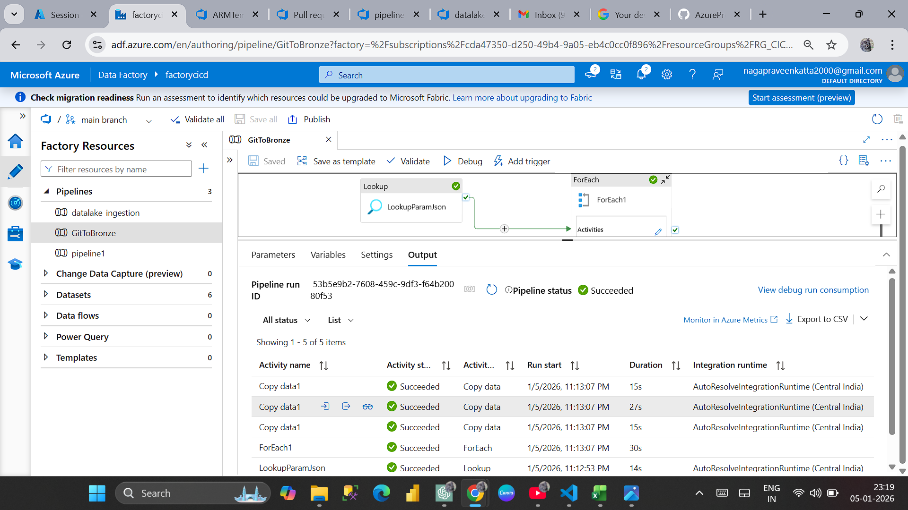
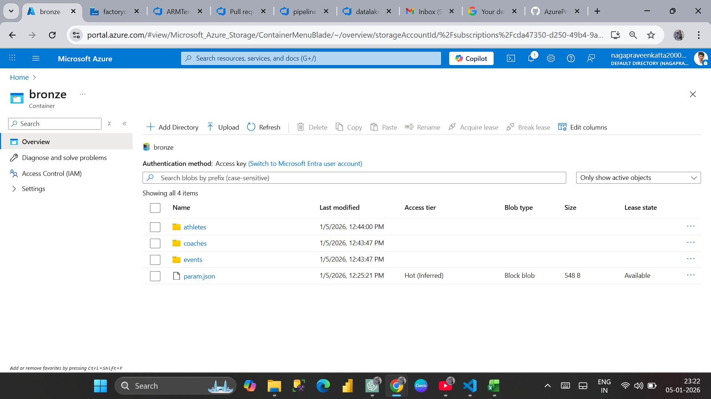

# Stage 1 – CSV ingestion

What this stage does:
This stage ingests CSV files from an HTTP-based API endpoint
and stores them in Azure Data Lake as Parquet files.

Source:
- CSV files are accessed via HTTP URLs
- The source acts as an API endpoint returning CSV data

Configuration:
- A parameter JSON file is used to dynamically control source URLs
  and target output paths, avoiding hardcoded values.

Process:
- Azure Data Factory calls the HTTP endpoint
- Files are processed one by one
- Data is written to the Bronze layer in Parquet format

Output:
- Parquet files are created in the Bronze container

Pipeline:

Parameterization:

Execution:

Output:

