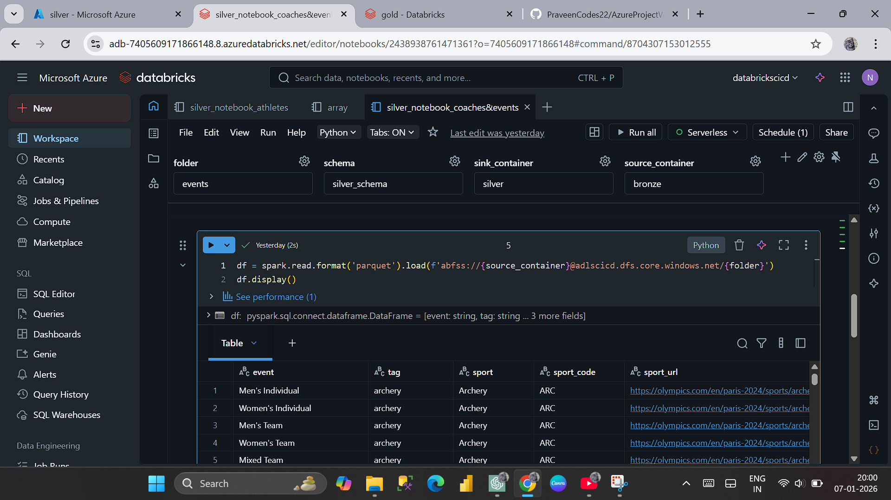
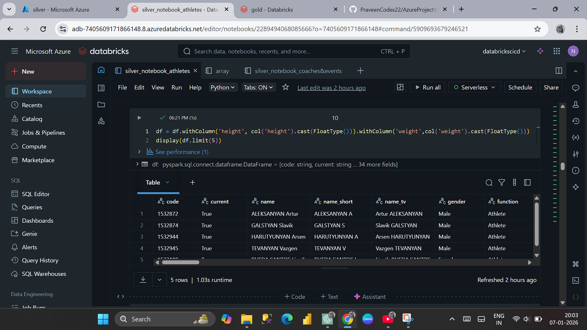
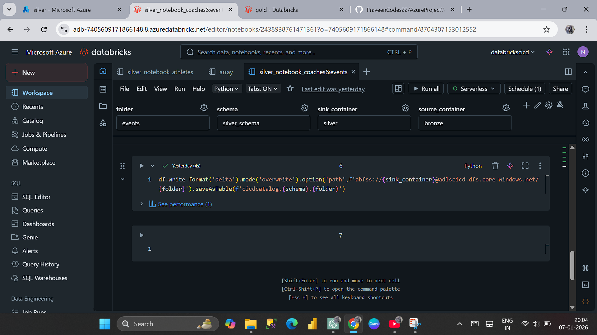

# Stage 2 – Bronze to Silver Transformation

What this stage does:
This stage transforms raw Bronze layer data and loads cleaned,
structured data into the Silver layer using Databricks and Delta tables.

Source:
- Data is read from the Bronze container in Azure Data Lake
- Input data is stored in Parquet format

Transformation Approach:
- Transformations are implemented using PySpark notebooks
- Data is written to the Silver layer as Delta tables
- Basic cleaning and standardization logic is applied

Parameterization:
- A parameter array is used to control source container, target container,
  and dataset folder names
- A single notebook processes multiple datasets dynamically using parameters

Example parameter structure:
- source_container: bronze
- sink_container: silver
- folder: events / coaches

Notebook Design:
- silver_notebook_athletes
- silver_notebook_coaches_and_events
- One notebook handles multiple datasets where applicable

Automation:
- All Silver transformations are automated using Databricks Jobs
- Jobs orchestrate notebook execution using parameterized inputs
- Job runs are monitored to ensure successful execution

Output:
- Cleaned and transformed data is stored in the Silver layer
- Data is available as Delta tables for downstream processing

Silver Notebook (Representative):

Read from Bronze:

Transform Logic:

Write to Silver (Delta):

