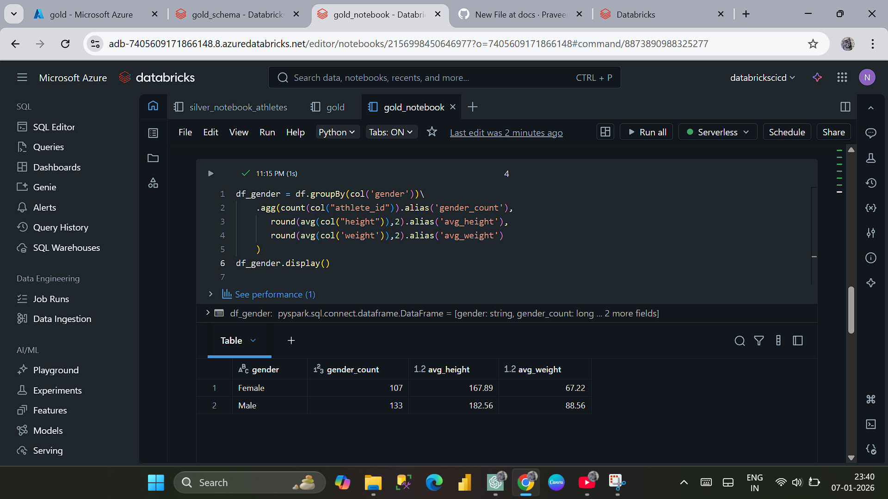
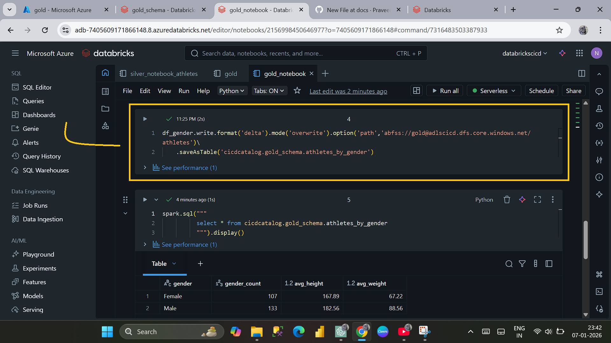
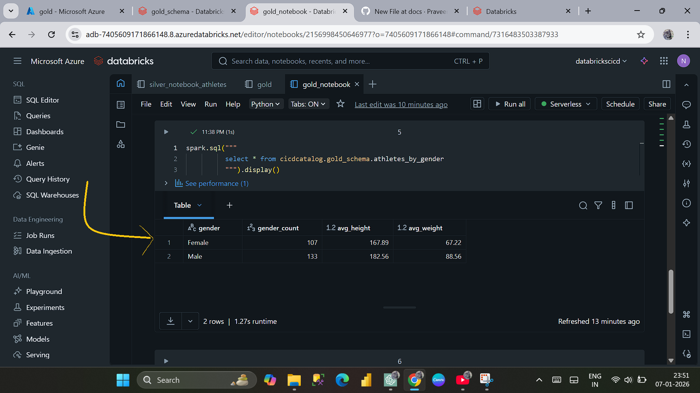

# Stage 3 – Silver to Gold Layer

What this stage does:
This stage creates analytics-ready Gold tables by aggregating
and transforming curated Silver layer data.

Source:
- Silver layer Delta tables

Process:
- Databricks notebooks read Silver data
- Aggregations such as counts and averages are applied based on bussiness logics
- Results are written to the Gold layer as Delta tables

Execution:
- Gold transformations are executed using Databricks notebooks

Output:
- Business-ready Gold Delta tables for analytics and reporting

Gold Notebook:

Gold Tables:

Gold Output:

